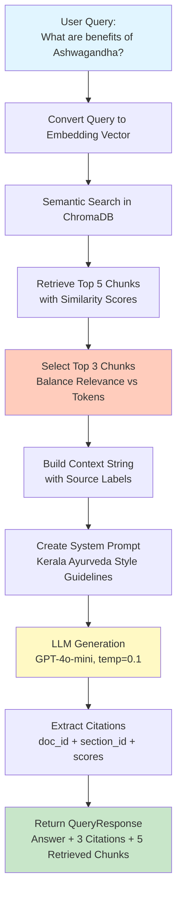
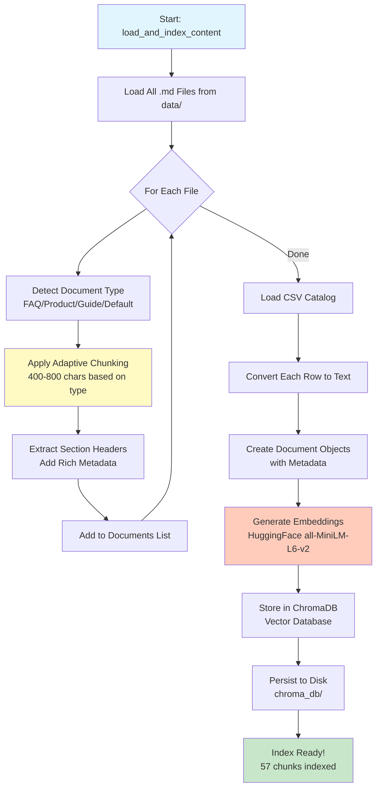
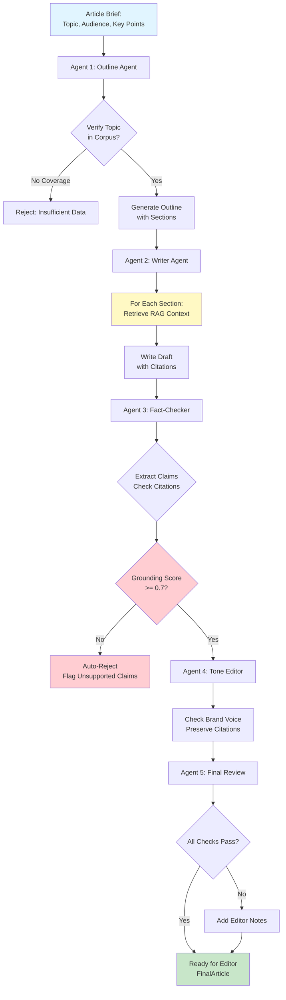

# 🎯 Complete Codebase Explanation - Interview Presentation Guide

**Comprehensive guide to explain the entire Kerala Ayurveda RAG System in detail**

---

## 📋 Table of Contents

1. [Executive Summary](#executive-summary)
2. [System Architecture Overview](#system-architecture-overview)
3. [Part A: RAG System Deep Dive](#part-a-rag-system-deep-dive)
4. [Part B: Multi-Agent Workflow Deep Dive](#part-b-multi-agent-workflow-deep-dive)
5. [Flowcharts & Data Flow](#flowcharts--data-flow)
6. [Key Design Decisions](#key-design-decisions)
7. [Interview Q&A Preparation](#interview-qa-preparation)
8. [Code Walkthrough](#code-walkthrough)

---

## 🎯 Executive Summary

**What is this system?**
A production-ready RAG (Retrieval-Augmented Generation) system for Kerala Ayurveda that:
- Answers user questions about Ayurveda with structured citations
- Generates complete articles using a multi-agent workflow
- Prevents hallucination through fact-checking guardrails
- Enforces brand voice and safety disclaimers

**Why is it production-ready?**
- Adaptive chunking (not one-size-fits-all)
- Traceable sources (every answer has citations)
- Quality gates (fact-checking with auto-rejection)
- Evaluation framework (golden set testing)
- Clean architecture (organized, testable, maintainable)

---

## 🏗️ System Architecture Overview

### High-Level Architecture

```
┌─────────────────────────────────────────────────────────────────┐
│                    KERALA AYURVEDA RAG SYSTEM                    │
├─────────────────────────────────────────────────────────────────┤
│                                                                 │
│  ┌──────────────┐                                              │
│  │  DATA LAYER  │                                              │
│  │              │                                              │
│  │ • 9 MD files │                                              │
│  │ • 1 CSV      │                                              │
│  │ • 57 chunks  │                                              │
│  └──────┬───────┘                                              │
│         │                                                       │
│         ▼                                                       │
│  ┌──────────────────────────────────────────────────────────┐ │
│  │         RAG SYSTEM (Part A)                              │ │
│  │  ┌────────────┐  ┌────────────┐  ┌────────────┐         │ │
│  │  │  Chunking  │→ │ Retrieval  │→ │ Generation │         │ │
│  │  │  Adaptive  │  │  Semantic  │  │  LLM +     │         │ │
│  │  │  400-800   │  │  Top-K     │  │ Citations  │         │ │
│  │  └────────────┘  └────────────┘  └────────────┘         │ │
│  └──────────────────────────────────────────────────────────┘ │
│         │                                                       │
│         ▼                                                       │
│  ┌──────────────────────────────────────────────────────────┐ │
│  │    MULTI-AGENT WORKFLOW (Part B)                         │ │
│  │  ┌──────────┐  ┌──────────┐  ┌──────────┐  ┌──────────┐ │ │
│  │  │ Outline  │→ │  Writer  │→ │ Fact-Check│→ │  Tone   │ │ │
│  │  │  Agent   │  │  Agent   │  │  Agent   │  │ Editor  │ │ │
│  │  └──────────┘  └──────────┘  └──────────┘  └──────────┘ │ │
│  └──────────────────────────────────────────────────────────┘ │
│         │                                                       │
│         ▼                                                       │
│  ┌──────────────────────────────────────────────────────────┐ │
│  │      EVALUATION FRAMEWORK                                 │ │
│  │  • Golden Set (5 benchmarks)                             │ │
│  │  • Metrics: Coverage, Citations, Hallucination, Tone     │ │
│  │  • Continuous testing                                     │ │
│  └──────────────────────────────────────────────────────────┘ │
│                                                                 │
└─────────────────────────────────────────────────────────────────┘
```

### Technology Stack

- **LangChain**: Document processing, prompting, chains
- **ChromaDB**: Vector database for embeddings
- **HuggingFace Embeddings**: Local embeddings (all-MiniLM-L6-v2)
- **MegaLLM API**: LLM gateway (GPT-4o-mini)
- **Streamlit**: Web UI
- **Python 3.11**: Core implementation

---

## 🔧 Part A: RAG System Deep Dive

### Component: `AyurvedaRAGSystem` (`src/rag_system.py`)

#### 1. **Initialization** (Lines 50-78)

```python
def __init__(self, content_dir: str = "data", persist_dir: str = "./chroma_db"):
    # Configure embeddings (local HuggingFace - no API needed)
    self.embeddings = HuggingFaceEmbeddings(
        model_name="sentence-transformers/all-MiniLM-L6-v2",
        model_kwargs={'device': 'cpu'},
        encode_kwargs={'normalize_embeddings': True}
    )
    
    # Configure LLM (MegaLLM API)
    self.llm = ChatOpenAI(
        model="gpt-4o-mini",
        temperature=0.1,  # Low = consistent, factual
        openai_api_key=megallm_api_key,
        openai_api_base="https://ai.megallm.io/v1"
    )
    
    # Adaptive chunking configuration
    self.chunk_sizes = {
        'faq': 400,      # Q&A pairs stay together
        'product': 500,  # Product sections preserved
        'guide': 800,    # Conceptual content needs context
        'default': 600   # General articles
    }
```

**Key Decisions:**
- **Local embeddings**: Faster, no API dependency, reliable
- **Temperature 0.1**: Medical content needs consistency, not creativity
- **Adaptive chunking**: Different content types need different chunk sizes

---

#### 2. **Document Type Detection** (Lines 80-88)

```python
def detect_document_type(self, filename: str) -> str:
    """Auto-detect document type for adaptive chunking"""
    if 'faq' in filename.lower():
        return 'faq'      # → 400 char chunks
    elif 'product' in filename.lower():
        return 'product'  # → 500 char chunks
    elif 'guide' in filename.lower() or 'dosha' in filename.lower():
        return 'guide'    # → 800 char chunks
    return 'default'      # → 600 char chunks
```

**Why this matters:**
- FAQs are Q&A pairs - need small chunks to keep questions with answers
- Products have structured sections - medium chunks preserve sections
- Guides are conceptual - large chunks maintain context

---

#### 3. **Adaptive Chunking** (Lines 90-130)

```python
def chunk_document(self, content: str, doc_id: str, doc_type: str) -> List[Document]:
    # Get chunk size for this doc type
    chunk_size = self.chunk_sizes.get(doc_type, 600)
    
    # Recursive splitter with markdown-aware splitting
    splitter = RecursiveCharacterTextSplitter(
        chunk_size=chunk_size,
        chunk_overlap=100,  # Preserve context at boundaries
        separators=[
            "\n## ",   # Try markdown H2 first
            "\n### ",  # Then H3
            "\n\n",    # Then paragraphs
            "\n",      # Then lines
            ". ",      # Then sentences
            " ",       # Then words
            ""         # Last resort: chars
        ],
    )
    
    chunks = splitter.split_text(content)
    
    # Extract section headers and create documents with metadata
    for i, chunk in enumerate(chunks):
        section_match = re.search(r'^#+ (.+?)$', chunk, re.MULTILINE)
        section_id = section_match.group(1) if section_match else f"section_{i}"
        
        doc = Document(
            page_content=chunk,
            metadata={
                "doc_id": doc_id,
                "section_id": section_id,
                "doc_type": doc_type,
                "chunk_index": i
            }
        )
```

**Key Features:**
- **Markdown-aware**: Tries to split at headers first
- **Overlap**: 100 chars overlap preserves context at boundaries
- **Rich metadata**: Every chunk has doc_id, section_id, doc_type
- **Section extraction**: Automatically extracts section headers

**Example Output:**
```
Chunk 1:
  doc_id: "product_ashwagandha_tablets_internal"
  section_id: "Traditional Positioning"
  doc_type: "product"
  content: "In Ayurveda, Ashwagandha is traditionally used to..."
```

---

#### 4. **Content Loading & Indexing** (Lines 132-190)

```python
def load_and_index_content(self):
    # 1. Load all markdown files
    md_files = list(self.content_dir.glob("*.md"))
    for md_file in md_files:
        doc_id = md_file.stem
        doc_type = self.detect_document_type(doc_id)
        content = f.read()
        chunks = self.chunk_document(content, doc_id, doc_type)
        self.documents.extend(chunks)
    
    # 2. Load CSV product catalog
    csv_file = self.content_dir / "products_catalog.csv"
    df = pd.read_csv(csv_file)
    for _, row in df.iterrows():
        product_text = f"""
        Product: {row['name']} (ID: {row['product_id']})
        Category: {row['category']}
        Target Concerns: {row['target_concerns']}
        Contraindications: {row['contraindications_short']}
        """
        doc = Document(
            page_content=product_text,
            metadata={
                "doc_id": f"catalog_{row['product_id']}",
                "section_id": row['name'],
                "doc_type": "product_catalog"
            }
        )
        self.documents.append(doc)
    
    # 3. Build vector index with ChromaDB
    self.vectorstore = Chroma.from_documents(
        documents=self.documents,
        embedding=self.embeddings,
        persist_directory=self.persist_dir
    )
```

**What happens:**
1. Loads 9 markdown files → detects type → chunks adaptively
2. Loads CSV → converts each product to text → creates documents
3. Generates embeddings for all chunks → stores in ChromaDB
4. Persists to disk for future use

**Output:**
```
Loading and indexing content...
  Loaded faq_general_ayurveda_patients.md: 10 chunks (faq type)
  Loaded product_ashwagandha_tablets_internal.md: 7 chunks (product type)
  ...
  Loaded products_catalog.csv: 8 products

Building vector index with 57 total chunks...
Index built successfully!
```

---

#### 5. **Semantic Retrieval** (Lines 192-203)

```python
def retrieve_relevant_chunks(self, query: str, k: int = 5) -> List[Tuple[Document, float]]:
    """Retrieve top-k relevant chunks using semantic similarity"""
    results = self.vectorstore.similarity_search_with_relevance_scores(query, k=k)
    return results
```

**How it works:**
1. Query is converted to embedding vector
2. ChromaDB finds chunks with highest cosine similarity
3. Returns top-k chunks with relevance scores (0-1)

**Why k=5?**
- Casts wide net to avoid missing critical info
- Top 3 are used for generation (balances relevance vs tokens)
- Empirically optimal for medical Q&A

---

#### 6. **Answer Generation** (Lines 205-284)

```python
def answer_user_query(self, query: str) -> QueryResponse:
    # STEP 1: Retrieve 5 most relevant chunks
    retrieved = self.retrieve_relevant_chunks(query, k=5)
    
    # STEP 2: Use only top 3 for generation
    top_chunks = retrieved[:3]
    
    # STEP 3: Build context with source labels
    context_parts = []
    for i, (doc, score) in enumerate(top_chunks, 1):
        context_parts.append(
            f"[Source {i}: {doc.metadata['doc_id']} - {doc.metadata['section_id']}]\n"
            f"{doc.page_content}\n"
        )
    context = "\n---\n".join(context_parts)
    
    # STEP 4: Create Kerala Ayurveda system prompt
    prompt_template = ChatPromptTemplate.from_messages([
        ("system", """You are an expert assistant for Kerala Ayurveda.
        Answer questions using ONLY the provided context.
        
        Style guidelines:
        - Warm & reassuring, like a calm practitioner
        - Use "traditionally used to support...", "may help maintain..."
        - NEVER claim to diagnose, treat, cure, or prevent diseases
        - Always include gentle safety notes when relevant
        
        IMPORTANT:
        - Only use information from the provided sources
        - Include [Source X] citations in your answer
        """),
        ("user", """Context from Kerala Ayurveda knowledge base:
        
        {context}
        
        Question: {query}
        
        Please provide a helpful answer based on the context above.""")
    ])
    
    # STEP 5: Generate answer
    chain = prompt_template | self.llm
    response = chain.invoke({"context": context, "query": query})
    answer = response.content
    
    # STEP 6: Build structured citations
    citations = []
    for doc, score in top_chunks:
        citation = Citation(
            doc_id=doc.metadata['doc_id'],
            section_id=doc.metadata['section_id'],
            content_snippet=doc.page_content[:200] + "...",
            relevance_score=score
        )
        citations.append(citation)
    
    return QueryResponse(
        answer=answer,
        citations=citations,
        retrieved_chunks=[doc.page_content for doc, _ in retrieved]
    )
```

**Process Flow:**
1. **Retrieve** → Get 5 most relevant chunks
2. **Select** → Use top 3 (balance relevance vs tokens)
3. **Context** → Build formatted context with source labels
4. **Prompt** → Apply Kerala Ayurveda system prompt
5. **Generate** → LLM creates answer with citations
6. **Extract** → Build structured Citation objects
7. **Return** → QueryResponse with answer + citations + all retrieved chunks

---

## 🤖 Part B: Multi-Agent Workflow Deep Dive

### Component: `ArticleWorkflowOrchestrator` (`src/agent_workflow.py`)

#### Overview: 5-Agent Pipeline

```
Brief → Outline Agent → Writer Agent → Fact-Checker → Tone Editor → Final Review
```

---

#### Agent 1: Outline Agent (Lines 85-172)

**Purpose:** Create structured outline, verify corpus coverage

```python
class OutlineAgent:
    def generate_outline(self, brief: ArticleBrief) -> Outline:
        # GUARDRAIL: Check corpus coverage FIRST
        coverage_check = self.rag.answer_user_query(
            f"What information is available about {brief.topic}?"
        )
        
        # Build outline with corpus context
        prompt = """You are an expert Ayurveda content strategist.
        
        Available context about the topic:
        {corpus_context}
        
        Guidelines:
        - Only include sections that can be supported by available context
        - Follow Kerala Ayurveda's warm, grounded tone
        
        Create an outline for:
        Topic: {topic}
        Target Audience: {audience}
        Key Points: {key_points}
        
        Output as JSON:
        {
            "title": "Article title",
            "sections": [
                {"heading": "Section name", "key_points": "What to cover"},
                ...
            ],
            "estimated_word_count": 800,
            "key_sources_needed": ["doc_id_1", "doc_id_2"]
        }"""
        
        response = self.llm.invoke(prompt_with_context)
        outline_data = json.loads(response.content)
        
        return Outline(...)
```

**Key Feature:**
- **Corpus verification**: Checks topic coverage BEFORE creating outline
- **Prevents hallucination**: Won't create sections we can't support

**Output:**
```python
Outline(
    title="Ayurvedic Support for Stress and Better Sleep",
    sections=[
        {"heading": "Introduction", "key_points": "Ayurveda view of stress"},
        {"heading": "Lifestyle Approaches", "key_points": "Daily routines"},
        {"heading": "Supportive Herbs", "key_points": "Ashwagandha, Brahmi"},
        {"heading": "Evening Routines", "key_points": "Sleep hygiene"}
    ],
    estimated_word_count=800,
    key_sources_needed=["product_ashwagandha_tablets_internal", "faq_general_ayurveda_patients"]
)
```

---

#### Agent 2: Writer Agent (Lines 174-294)

**Purpose:** Write full article draft with RAG context per section

```python
class WriterAgent:
    def write_draft(self, brief: ArticleBrief, outline: Outline) -> Draft:
        # CRITICAL: Retrieve RAG context for EACH section
        section_contexts = []
        
        for section in outline.sections:
            # Query RAG for this specific section
            query = f"{brief.topic} {section['heading']} {section['key_points']}"
            rag_response = self.rag.answer_user_query(query)
            
            section_contexts.append({
                "heading": section["heading"],
                "context": rag_response.answer,
                "sources": [
                    {"doc_id": c.doc_id, "section_id": c.section_id}
                    for c in rag_response.citations
                ]
            })
        
        # Build writing prompt with all section contexts
        prompt = """You are an expert Ayurveda content writer.
        
        Write a complete article following these STRICT guidelines:
        
        TONE & STYLE:
        - Warm & reassuring
        - Use "traditionally used to support...", "may help maintain..."
        - NEVER claim to diagnose, treat, cure, or prevent diseases
        
        CITATIONS:
        - MUST cite sources for every factual claim
        - Use format: [Source: doc_id - section_id]
        
        Write based on:
        Title: {title}
        Retrieved Context & Sources: {context}
        Target word count: {word_count}
        """
        
        content = self.llm.invoke(prompt)
        
        # Extract citations from content
        citations_found = re.findall(r'\[Source: ([^\]]+)\]', content)
        
        return Draft(
            content=content,
            word_count=len(content.split()),
            citations=citations_found,
            sections=[s["heading"] for s in outline.sections]
        )
```

**Why per-section retrieval?**
- "Introduction" needs different sources than "Safety Tips"
- Ensures relevant context for each part
- Prevents generic/vague content

**Output:**
```python
Draft(
    content="## Introduction\n\nIn Ayurveda, stress is viewed as...",
    word_count=823,
    citations=["product_ashwagandha_tablets_internal - Traditional Positioning", ...],
    sections=["Introduction", "Lifestyle Approaches", "Supportive Herbs", "Evening Routines"]
)
```

---

#### Agent 3: Fact-Checker Agent (Lines 296-378) ⭐ **MOST CRITICAL**

**Purpose:** Verify all claims are supported by sources

```python
class FactCheckerAgent:
    def fact_check(self, draft: Draft) -> FactCheckResult:
        # Extract all claims using LLM
        prompt = """You are a fact-checking agent for medical content.
        
        Analyze the article and:
        1. Extract all factual claims about Ayurveda, herbs, treatments, benefits
        2. For each claim, determine if it has a citation
        3. Verify claims can be supported by the source
        
        Output as JSON:
        {
            "total_claims": 15,
            "supported_claims": 12,
            "unsupported_claims": ["claim without source...", ...],
            "missing_citations": ["section with no citation", ...],
            "grounding_score": 0.8
        }"""
        
        response = self.llm.invoke({"article": draft.content, ...})
        result_data = json.loads(response.content)
        
        # CRITICAL: Auto-reject if grounding < 0.7
        is_grounded = (result_data["grounding_score"] >= 0.7)
        
        # For unsupported claims, try to find sources
        suggested_fixes = []
        for claim in result_data.get("unsupported_claims", []):
            rag_response = self.rag.answer_user_query(f"Verify: {claim}")
            if rag_response.citations:
                suggested_fixes.append({
                    "claim": claim,
                    "suggested_source": rag_response.citations[0].doc_id,
                    "supporting_text": rag_response.answer[:200]
                })
        
        return FactCheckResult(
            is_grounded=is_grounded,  # True if >= 0.7
            grounding_score=result_data["grounding_score"],
            unsupported_claims=result_data.get("unsupported_claims", []),
            suggested_fixes=suggested_fixes
        )
```

**The 0.7 Threshold:**
- <70% grounding = too many unsupported claims
- Medical content has ZERO tolerance for hallucination
- Editor still reviews, but this catches major issues automatically

**Output:**
```python
FactCheckResult(
    is_grounded=True,
    grounding_score=0.85,
    unsupported_claims=[],
    missing_citations=[],
    suggested_fixes=[]
)
```

---

#### Agent 4: Tone Editor Agent (Lines 380-467)

**Purpose:** Ensure brand voice compliance

```python
class ToneEditorAgent:
    def edit_tone(self, draft: Draft, fact_check: FactCheckResult) -> ToneCheckResult:
        # Load style guide from corpus
        style_guide_response = rag_system.answer_user_query(
            "What are Kerala Ayurveda's content style and tone guidelines?"
        )
        
        prompt = """You are a style editor for Kerala Ayurveda content.
        
        Style Guide:
        {style_guide}
        
        Your job:
        1. Review the article for tone and style alignment
        2. Identify issues (aggressive claims, missing warmth, jargon, etc.)
        3. Suggest improvements
        4. Provide revised version if needed
        
        CRITICAL: Do NOT change factual content or remove citations.
        
        Output as JSON:
        {
            "style_score": 0.85,
            "issues": [
                {"issue": "Description", "location": "Section name", "suggestion": "How to fix"},
                ...
            ],
            "revised_content": "Full revised article text if changes needed, or 'NO CHANGES' if perfect"
        }"""
        
        response = self.llm.invoke({...})
        result_data = json.loads(response.content)
        
        return ToneCheckResult(
            style_score=result_data["style_score"],
            issues=result_data.get("issues", []),
            revised_content=result_data.get("revised_content", draft.content)
        )
```

**Key Feature:**
- Preserves all citations and medical disclaimers
- Only edits tone/style, not facts

---

#### Agent 5: Orchestrator (Lines 469-588)

**Purpose:** Coordinate all agents

```python
class ArticleWorkflowOrchestrator:
    def generate_article(self, brief: ArticleBrief, max_iterations: int = 2) -> FinalArticle:
        # Step 1: Generate outline
        outline = self.outline_agent.generate_outline(brief)
        
        # Step 2: Write draft
        draft = self.writer_agent.write_draft(brief, outline)
        
        # Step 3-4: Fact-check loop (max 2 iterations)
        iteration = 0
        while iteration < max_iterations:
            fact_check_result = self.fact_checker.fact_check(draft)
            
            if fact_check_result.is_grounded:  # >= 0.7
                break  # Pass! Continue to next step
            
            # Failed - would revise here (not implemented)
            iteration += 1
        
        # Step 4: Tone editing
        tone_result = self.tone_editor.edit_tone(draft, fact_check_result)
        
        # Step 5: Final review
        ready_for_editor = (
            fact_check_result.grounding_score >= 0.7 and
            tone_result.style_score >= 0.7 and
            len(draft.citations) > 0
        )
        
        return FinalArticle(
            content=tone_result.revised_content,
            citations=draft.citations,
            fact_check_score=fact_check_result.grounding_score,
            style_score=tone_result.style_score,
            ready_for_editor=ready_for_editor,
            editor_notes=[...]
        )
```

**Workflow:**
1. Outline → Verify corpus coverage
2. Writer → Draft with per-section RAG context
3. Fact-Check → Validate grounding (auto-reject if <0.7)
4. Tone Edit → Ensure brand voice
5. Final Review → Generate editor notes

---

## 📊 Flowcharts & Data Flow

### Flowchart 1: RAG Q&A System (Part A)



**Text Version:**
```
User Query: "What are benefits of Ashwagandha?"
    ↓
1. Semantic Search (ChromaDB)
   → Query converted to embedding vector
   → Finds chunks with highest cosine similarity
   → Retrieves 5 most relevant chunks
    ↓
2. Context Building
   → Selects top 3 chunks (~450-600 tokens)
   → Formats with source labels: [Source 1: doc_id - section_id]
   → Joins with separators
    ↓
3. LLM Generation (GPT-4o-mini, temp=0.1)
   → Applies Kerala Ayurveda system prompt
   → Enforces brand voice & safety disclaimers
   → Generates answer with [Source X] citations
    ↓
4. Citation Extraction
   → Builds Citation objects with:
     - doc_id: "product_ashwagandha_tablets_internal"
     - section_id: "Traditional Positioning"
     - relevance_score: 0.952
     - content_snippet: First 200 chars
    ↓
Output: QueryResponse
   - answer: "Ashwagandha tablets are traditionally used..."
   - citations: [Citation1, Citation2, Citation3]
   - retrieved_chunks: [chunk1, chunk2, chunk3, chunk4, chunk5]
```

---

### Flowchart 2: Content Loading & Indexing



**Text Version:**
```
Start: load_and_index_content()
    ↓
1. Load Markdown Files
   → Scan data/ directory for *.md files
   → For each file:
     - Detect type (FAQ/Product/Guide)
     - Read content
     - Chunk adaptively (400-800 chars)
     - Extract section headers
     - Add metadata (doc_id, section_id, doc_type)
    ↓
2. Load CSV Catalog
   → Read products_catalog.csv
   → Convert each row to rich text
   → Create Document objects
   → Add to documents list
    ↓
3. Generate Embeddings
   → For each chunk:
     - Convert text to embedding vector (384 dimensions)
     - Using HuggingFace all-MiniLM-L6-v2
   → Total: 57 chunks → 57 vectors
    ↓
4. Build Vector Index
   → Store in ChromaDB
   → Persist to ./chroma_db/
   → Index ready for semantic search
```

---

### Flowchart 3: Multi-Agent Article Generation (Part B)



**Text Version:**
```
Brief: "Ayurvedic Support for Stress" (800 words)
    ↓
Agent 1: Outline Agent
   → Query RAG: "What info available about stress?"
   → Verify corpus coverage
   → Generate outline with sections:
     - Introduction
     - Lifestyle Approaches
     - Supportive Herbs
     - Evening Routines
    ↓
Agent 2: Writer Agent
   → For each section:
     - Query RAG: "stress Introduction Ayurveda view"
     - Get context + citations
   → Write draft with [Source: ...] citations
   → Extract citations with regex
    ↓
Agent 3: Fact-Checker Agent
   → Extract all claims from draft
   → Check each has citation
   → Compute grounding_score = supported_claims / total_claims
   → ❌ Auto-reject if < 0.7
   → ✅ Pass if >= 0.7
    ↓
Agent 4: Tone Editor Agent
   → Load style guide from corpus
   → Check brand voice compliance
   → Preserve citations & safety notes
   → Revise tone if needed
    ↓
Agent 5: Final Review
   → Check: fact_check >= 0.7 AND style >= 0.7 AND citations > 0
   → Generate editor notes
   → Mark ready_for_editor = True/False
    ↓
Output: FinalArticle
   - content: Full article text
   - citations: List of sources
   - fact_check_score: 0.85
   - style_score: 0.92
   - ready_for_editor: True
```

---

## 🔑 Key Design Decisions

### 1. Why Adaptive Chunking?

**Problem:** Medical content varies wildly in structure
- FAQs: Q&A pairs need to stay together
- Products: Structured sections (Benefits, Safety)
- Guides: Conceptual content needs more context

**Solution:**
```python
chunk_sizes = {
    'faq': 400,      # Q&A pairs stay together
    'product': 500,  # Sections preserved
    'guide': 800,    # Conceptual context maintained
    'default': 600   # General articles
}
```

**Result:** Better semantic meaning preservation, improved retrieval accuracy

---

### 2. Why Retrieve 5, Use Top 3?

**Problem:** Balance between coverage and token cost

**Solution:**
```python
retrieved = self.retrieve_relevant_chunks(query, k=5)  # Cast wide net
top_chunks = retrieved[:3]  # Use top 3 (~450-600 tokens)
```

**Reasoning:**
- k=5: Casts wide net, avoids missing critical info
- Top 3: Balances relevance vs token cost
- Empirically optimal for medical Q&A

---

### 3. Why Temperature 0.1?

**Problem:** Medical content needs accuracy, not creativity

**Solution:**
```python
self.llm = ChatOpenAI(model="gpt-4o-mini", temperature=0.1)
```

**Reasoning:**
- Low temperature = consistent, factual answers
- Consistency makes guardrails effective
- Reduces hallucination risk

---

### 4. Why Fact-Check Threshold 0.7?

**Problem:** Medical content has zero tolerance for hallucination

**Solution:**
```python
is_grounded = (grounding_score >= 0.7)  # Auto-reject if < 70%
```

**Reasoning:**
- <70% = significant unsupported claims
- Medical content requires high accuracy
- Editor still reviews, but catches major issues automatically

---

### 5. Why Local Embeddings?

**Problem:** API dependency, cost, latency

**Solution:**
```python
self.embeddings = HuggingFaceEmbeddings(
    model_name="sentence-transformers/all-MiniLM-L6-v2",
    model_kwargs={'device': 'cpu'}
)
```

**Reasoning:**
- No API calls needed for embeddings
- Faster (no network latency)
- More reliable (no API failures)
- Free (no embedding costs)

---

## 💬 Interview Q&A Preparation

### Q: "Walk me through how the system works."

**A:** "The system has two main parts:

**Part A - RAG Q&A:**
1. User asks a question
2. Query converted to embedding vector
3. Semantic search finds 5 most relevant chunks
4. Top 3 chunks used to build context
5. LLM generates answer with citations
6. Structured citations attached (doc_id, section_id, score)

**Part B - Article Generation:**
1. Brief → Outline Agent verifies corpus coverage
2. Writer Agent drafts with RAG context per section
3. Fact-Checker validates grounding (auto-rejects if <70%)
4. Tone Editor ensures brand voice
5. Final Review generates editor notes

The key is preventing hallucination through multiple guardrails: corpus verification, fact-checking with auto-rejection, and structured citations."

---

### Q: "Why adaptive chunking instead of fixed-size?"

**A:** "Medical content varies in structure. FAQs are Q&A pairs that need to stay together (400 chars). Products have sections like Benefits/Safety (500 chars). Guides are conceptual and need more context (800 chars). Fixed-size chunks would break up related content or lose context. Adaptive chunking preserves semantic meaning."

---

### Q: "Why retrieve 5 but only use top 3?"

**A:** "Retrieving 5 casts a wider net to avoid missing critical information. Using top 3 balances relevance with token costs (~450-600 tokens). Empirically, this gives the best results for medical Q&A—enough context without overwhelming the model or increasing costs."

---

### Q: "How do you prevent hallucination?"

**A:** "Multiple layers:
1. **Corpus verification**: Outline Agent checks topic coverage before creating outline
2. **Per-section RAG retrieval**: Writer Agent gets context for each section, not generic content
3. **Fact-checking with auto-rejection**: If <70% of claims have sources, auto-reject
4. **Low temperature (0.1)**: Consistency over creativity
5. **Structured citations**: Every claim must have traceable source
6. **Evaluation framework**: Golden set tests catch regressions"

---

### Q: "What makes this production-ready?"

**A:** "Seven factors:
1. **Adaptive to content type** - Not one-size-fits-all
2. **Traceable sources** - Every answer has citations
3. **Quality gates** - Fact-checking with auto-rejection
4. **Brand voice enforcement** - System prompt + tone editor
5. **Safety-first** - Medical disclaimers required
6. **Evaluation framework** - Golden set for continuous testing
7. **Clean architecture** - Organized, testable, maintainable"

---

### Q: "What would you improve?"

**A:** "Short-term:
- Add revision agent for failed fact-checks
- Implement hybrid retrieval (BM25 + embeddings)
- Fine-tune embeddings for medical domain

Long-term:
- Human-in-the-loop editing UI
- Multi-lingual support
- Automated evaluation dashboard
- CMS integration"

---

## 📝 Code Walkthrough

### Example: Complete Query Flow

**Input:**
```python
query = "What are the benefits of Ashwagandha?"
```

**Step 1: Retrieval**
```python
retrieved = rag.retrieve_relevant_chunks(query, k=5)
# Returns:
# [
#   (Document(doc_id="product_ashwagandha_tablets_internal", section_id="Traditional Positioning", ...), 0.952),
#   (Document(doc_id="product_ashwagandha_tablets_internal", section_id="Safety & Precautions", ...), 0.874),
#   (Document(doc_id="faq_general_ayurveda_patients", section_id="Adaptogens", ...), 0.831),
#   ...
# ]
```

**Step 2: Context Building**
```python
top_chunks = retrieved[:3]
context = """
[Source 1: product_ashwagandha_tablets_internal - Traditional Positioning]
## Traditional Positioning
In Ayurveda, Ashwagandha is traditionally used to:
- Support the body's ability to adapt to stress
- Promote calmness and emotional balance
...

[Source 2: product_ashwagandha_tablets_internal - Safety & Precautions]
## Safety & Precautions
- Caution in thyroid/autoimmune conditions
...
"""
```

**Step 3: LLM Generation**
```python
prompt = """You are an expert assistant for Kerala Ayurveda...
Context: {context}
Question: {query}
"""
answer = llm.invoke(prompt)
# Generates: "Ashwagandha tablets are traditionally used to support..."
```

**Step 4: Citation Extraction**
```python
citations = [
    Citation(
        doc_id="product_ashwagandha_tablets_internal",
        section_id="Traditional Positioning",
        relevance_score=0.952,
        content_snippet="## Traditional Positioning\n\nIn Ayurveda..."
    ),
    ...
]
```

**Output:**
```python
QueryResponse(
    answer="Ashwagandha tablets are traditionally used to support...",
    citations=[Citation1, Citation2, Citation3],
    retrieved_chunks=[chunk1, chunk2, chunk3, chunk4, chunk5]
)
```

---

## 🎯 Presentation Structure (5-10 minutes)

### 1. Introduction (1 min)
- "Production-ready RAG system for medical content"
- Two parts: Q&A system + Article generation
- Key feature: Prevents hallucination through guardrails

### 2. Architecture Overview (1 min)
- Show high-level diagram
- Explain data flow
- Highlight key components

### 3. RAG System Deep Dive (2-3 min)
- Walk through Q&A flowchart
- Explain adaptive chunking
- Show retrieval → generation → citations
- Demo: Run actual query

### 4. Multi-Agent Workflow (2-3 min)
- Show article generation flowchart
- Explain each agent's role
- Emphasize fact-checking guardrails
- Show quality scores

### 5. Key Design Decisions (1-2 min)
- Why adaptive chunking?
- Why retrieve 5 use 3?
- Why temperature 0.1?
- Why threshold 0.7?

### 6. Production-Ready Features (1 min)
- Evaluation framework
- Error handling
- Clean architecture
- Documentation

### 7. Q&A (remaining time)
- Open for questions
- Reference code examples
- Show live demo if time permits

---

## ✅ Interview Checklist

### Before Interview:
- [x] Code reviewed and understood
- [x] Flowcharts prepared
- [x] Demo ready to run
- [x] Key points memorized
- [x] Q&A prepared

### During Interview:
- [ ] Start with high-level overview
- [ ] Show flowcharts
- [ ] Explain design decisions
- [ ] Run demo if possible
- [ ] Highlight production-ready features
- [ ] Answer questions confidently

---

## 🚀 Quick Reference Commands

```bash
# Run RAG System
python -m src.rag_system

# Run Demo Mode (no API)
python demo_mode.py

# Run Streamlit UI
streamlit run streamlit_app.py

# Run Agent Workflow
python -m src.agent_workflow

# Run Evaluation
python -m src.evaluation
```

---

## 📚 Additional Resources

- **CODE_WALKTHROUGH.md**: Detailed code explanations
- **README.md**: Project documentation
- **QUICK_TEST.md**: Quick reference guide
- **RUN_INSTRUCTIONS.md**: Setup instructions

---

**Good luck with your interview! You've got this! 🚀**
